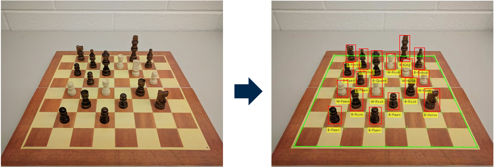

# Chess Piece Recognition
Demo for the WACV'18 paper "[Chess Piece Recognition Using Oriented Chamfer Matching with a Comparison to CNN]"
(http://inside.mines.edu/~whoff/publications/2018/WACV2018.pdf)

   

# Abstract
Recognizing three dimensional chess pieces using computer vision is needed for an augmented reality chess assistant. This paper proposes an efficient 3D pieces recognition approach based on oriented chamfer matching. During a real game, the pieces might be occluded by other pieces and have varying rotation and scales with respect to the camera. Furthermore, different pieces share lots of similar texture features which makes them more difficult to identify. Our approach addresses the above problems and is capable of identifying the pieces with different scales, rotation and viewing angles. After marking the possible chessboard squares that contain pieces, the oriented chamfer scores are calculated for alternative templates and the recognized pieces are indicated on the input image accordingly. Our approach shows high recognition accuracy and efficiency in experiments and the recognition process can be easily generalized to other pattern recognition applications with 3D templates. Our approach outperforms the convolutional neural networks under severe occlusion and low resolution conditions and has comparative processing time while avoids the time consuming training process.

# Usage
- Change the hyperparameter in 'main.m' file based on the condition you want to test.
- Run 'main.m' to implement the piece recognition.

# Citation
If you use our method and/or codes, please cite our paper

```
@inproceedings{xie2018chess,
    author={Xie, Youye and Tang, Gongguo and Hoff, William},
    title = {Chess Piece Recognition Using Oriented Chamfer Matching with a Comparison to CNN},
    booktitle = {IEEE Winter Conference on Applications of Computer Vision (WACV)},
    year = {2018}
    organization={IEEE}
}
```
